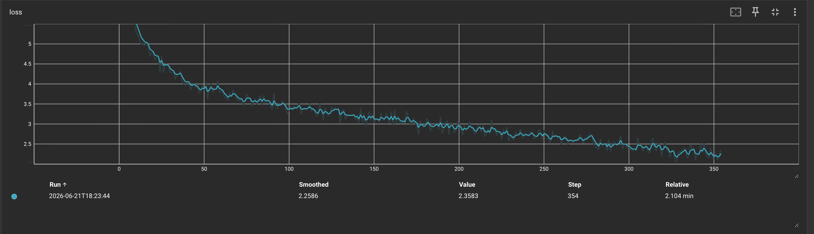

<](https://pytorch.org/)
[](https://python.org/)
[](LICENSE)
[](#-hardware--memory-optimization)

*Every attention head, every rotary embedding, every KV-cache append — written by hand, tested, and optimized for consumer hardware.*

</div>

---

## 🔍 What Is This?

TinyGPT is a **custom, ground-up implementation** of a modern decoder-only large language model. It implements the same architecture class that powers **Llama, SmolLM2, and Mistral** — but every line of the forward pass, attention stack, caching strategy, and generation loop is **hand-written in pure PyTorch**.

> **This is not a wrapper.** Hugging Face `.safetensors` files are used only as _source artifacts_ for weight conversion. The runtime path — from token embedding to logit projection — is entirely custom.

### Why does this matter?

Production LLM frameworks are powerful, but they hide the exact tensor operations that make transformers work. TinyGPT strips away those abstraction layers and keeps the important parts **visible and auditable**:

| What's implemented from scratch | Why it matters |
|---|---|
| **Grouped Query Attention (GQA)** | Reduces KV-cache memory by sharing key/value heads across query groups |
| **Rotary Positional Embeddings (RoPE)** | Encodes position directly into Q/K dot products — no learned position table |
| **KV-Cache Inference** | Prefill once, then decode token-by-token with O(1) per step instead of O(n) |
| **SwiGLU Feed-Forward** | Gated MLP with SiLU activation — the Llama-style FFN block |
| **RMSNorm** | Pre-norm architecture with root mean square layer normalization |
| **Weight Tying** | `embed_tokens` and `vocab_proj` share the exact same tensor in memory |
| **Mixed-Precision Training** | Automatic `float16`/`bfloat16` casting with gradient scaling |
| **Safetensors Weight Surgery** | Offline key remapping from HF checkpoint format into custom module hierarchy |

---

## ⚙️ Architecture Deep Dive

TinyGPT cleanly separates **model definition**, **configuration**, and **runtime construction** into focused modules:

```text
tiny_gpt/
├── config.py         # Typed profile registry (frozen dataclasses, zero YAML)
├── modeling.py       # Model & tokenizer factory dispatch
├── generate.py       # KV-cache generation loop with top-k sampling
├── train.py          # Mixed-precision training with TensorBoard logging
├── adapter.py        # Offline HF .safetensors → TinyGPT checkpoint conversion
├── artifacts.py      # Profile-driven artifact download from Hugging Face Hub
├── data_prep.py      # Tokenized dataset preparation pipeline
└── models/
    ├── scratch.py    # Compact GPT with fused QKV projection
    └── smollm2.py    # Full SmolLM2/Llama-style architecture
```

### The SmolLM2 Forward Pass

The SmolLM2 implementation follows the exact architecture of modern compact LLMs:

```
Input IDs → Embedding → [RoPE + GQA + RMSNorm + SwiGLU] × 32 layers → Final RMSNorm → Vocab Projection → Logits
                              ↑                                                              ↑
                        KV-Cache read/write                                          Weight-tied to Embedding
```

**Key engineering decisions:**
- **RoPE** is computed once per forward pass and shared through a `ForwardContext` dataclass — no redundant trig recomputation across layers.
- **GQA** uses `repeat_interleave` to expand KV heads to match query head count, with explicit dimensionality validation.
- **KV-Cache** stores per-layer `(key, value)` tensors and appends new tokens via `torch.cat` — no full-sequence recomputation during generation.
- **Causal masking** is applied only during multi-token prefill (`seq_len > 1`); single-token decode steps skip masking entirely.

---

## 🗂️ The Profile Registry — Zero YAML, Pure Python

One of TinyGPT's cleanest design decisions is how model variants are managed. Instead of sprawling YAML files, messy dictionaries, or fragile CLI flag combinations, every model configuration lives as a **frozen, type-checked Python dataclass**:

```python
from dataclasses import dataclass, replace
from enum import StrEnum

class ModelFamily(StrEnum):
    SCRATCH_GPT = "scratch_gpt"
    SMOLLM2 = "smollm2"

@dataclass(frozen=True)
class ModelSpec:
    family: ModelFamily
    max_seq_len: int
    vocab_size: int
    embed_dim: int
    num_heads: int
    num_kv_heads: int     # GQA: fewer KV heads than query heads
    num_layers: int
    tokenizer: TokenizerSpec
    rope_base: int = 10000
    rms_eps: float = 1e-4
    hidden_dim: int | None = None

@dataclass(frozen=True)
class Profile:
    name: str
    model: ModelSpec
    training: TrainingSpec | None = None
    generation: GenerationSpec | None = None
    hf_artifacts: HFArtifactSpec | None = None
    base_profile: str | None = None    # Profile inheritance!
```

Defining a new model variant is a **one-shot registration** — every parameter is typed, immutable, and IDE-autocomplete-friendly:

```python
# SmolLM2-360M: 32 layers, 15 query heads, 5 KV heads (GQA ratio = 3:1)
smollm2_360m = register(
    Profile(
        name="smollm2_360m",
        model=ModelSpec(
            family=ModelFamily.SMOLLM2,
            max_seq_len=8192,
            vocab_size=49152,
            embed_dim=960,
            num_heads=15,
            num_kv_heads=5,   # 3× fewer KV heads → 3× less cache memory
            num_layers=32,
            hidden_dim=2560,
            tokenizer=SMOLLM2_TOKENIZER,
        ),
        generation=GenerationSpec(
            checkpoint_path=REPO_ROOT / "artifacts" / "checkpoints" / "smollm2_360m.pt",
            max_new_tokens=1000,
            temperature=1.0,
            top_k=10,
        ),
    )
)
```

**Want to fine-tune it?** Profile inheritance makes SFT a config-level change — no code duplication:

```python
register(
    Profile(
        name="sft_smollm2_360m",
        model=smollm2_360m_model,
        training=TrainingSpec(
            batch_size=1,
            learning_rate=1e-5,
            max_seq_len=2048,
            output_checkpoint=REPO_ROOT / "artifacts" / "checkpoints" / "sft_smollm2_360m.pt",
            ...
        ),
        base_profile="smollm2_360m",   # Inherits generation + HF artifact config
    )
)
```

### Available Profiles

| Profile | Architecture | Layers | Heads (Q/KV) | Embed Dim | Params | Use Case |
|---|---|---|---|---|---|---|
| `dusty8m` | Custom GPT | 8 | 8 / 4 | 256 | ~8M | Dusty pretraining |
| `scratch_small` | Custom GPT | 6 | 8 / 2 | 512 | ~25M | Local training & experimentation |
| `smollm2_135m` | SmolLM2/Llama | 30 | 9 / 3 | 576 | 135M | Lightweight inference |
| `smollm2_360m` | SmolLM2/Llama | 32 | 15 / 5 | 960 | 360M | Full-scale inference & SFT |
| `sft_smollm2_360m` | SmolLM2/Llama | 32 | 15 / 5 | 960 | 360M | Supervised fine-tuning |

---

## 💻 Hardware & Memory Optimization

TinyGPT's training loop and KV-cache generation are **heavily optimized for consumer hardware**, with first-class support for **Apple Silicon (M1/M2/M3/M4) Macs**.

### Training Memory Footprint

The training pipeline uses **automatic mixed-precision** casting — `float16` on MPS (Apple Silicon), `bfloat16` on CUDA, `float32` on CPU — with per-device gradient scaling:

```python
device, dtype = get_device_and_dtype()
# → ("mps", torch.float16) on Apple Silicon
# → ("cuda", torch.bfloat16) on NVIDIA GPUs
# → ("cpu", torch.float32) as fallback

with torch.autocast(device_type=device, dtype=dtype, enabled=device != "cpu"):
    logits = model(inputs)
```

#### `scratch_small` — Memory Math on Apple Silicon

| Component | Calculation | Memory |
|---|---|---|
| Model params (~25M) | 25M × 2 bytes (fp16) | ~50 MB |
| Optimizer state (AdamW) | 25M × 2 × 4 bytes (fp32 moments) | ~200 MB |
| Activations (batch=16, seq=256) | 16 × 256 × 512 × 6 layers × 2 bytes | ~25 MB |
| Gradients | 25M × 2 bytes | ~50 MB |
| **Total estimated** | | **~325 MB** |

> 💡 **The `scratch_small` profile trains comfortably on an 8GB MacBook Air.** For 16GB+ machines, increase `batch_size` to `32` for better throughput. If you hit OOM, lower `batch_size` to `8` first — it reduces memory without changing the learning objective.

### KV-Cache Memory During Generation

The KV-cache stores per-layer key/value tensors, growing linearly with sequence length:

| Profile | Cache per token per layer | 1024-token cache (all layers) |
|---|---|---|
| `scratch_small` (2 KV heads, dim=64) | 2 × 64 × 2 × 2B = **512 B** | 6 layers × 512 B × 1024 = **3 MB** |
| `smollm2_360m` (5 KV heads, dim=64) | 2 × 5 × 64 × 2B = **1.25 KB** | 32 layers × 1.25 KB × 1024 = **40 MB** |

> GQA's reduced KV head count is the key optimization here — the 360M model uses **3× less cache memory** than it would with full multi-head attention.

---

## 🚀 Quickstart

### Prerequisites

TinyGPT uses [`uv`](https://docs.astral.sh/uv/) for fast, reproducible dependency management.

### Install

```bash
# Core dependencies
uv sync

# With dev tools (pytest)
uv sync --group dev
```

### 🔄 Download & Convert a Pre-trained Model

Fetch SmolLM2-360M weights from Hugging Face and convert them into TinyGPT's checkpoint format — one command:

```bash
uv run python -m tiny_gpt.artifacts download \
  --profile smollm2_360m \
  --convert
```

This downloads the raw `.safetensors` and tokenizer into `artifacts/`, then runs the key-remapping adapter to produce a TinyGPT-native checkpoint.

<details>
<summary>📎 Already have the weights? Conversion-only commands</summary>

If the files are already present and you only need conversion:
```bash
uv run python -m tiny_gpt.adapter --profile smollm2_360m
```

If you manually downloaded a safetensors file to a custom path:
```bash
uv run python -m tiny_gpt.adapter \
  --profile smollm2_360m \
  --hf-model-path artifacts/hf/smollm2_360m.safetensors
```
</details>

Want the smaller 135M model instead?

```bash
uv run python -m tiny_gpt.artifacts download \
  --profile smollm2_135m \
  --convert
```

### ⚡ Generate Text

```bash
uv run python -m tiny_gpt.generate --profile smollm2_360m
```

### 🏋️ Train From Scratch

Train a small GPT model on a local text corpus — fully from scratch, no pre-trained weights needed:

Generate Dusty data with OpenRouter, then train:

```bash
export OPENAI_API_KEY="YOUR_OPENROUTER_API_KEY"

# 1. Generate raw pretraining text into artifacts/datasets/dusty_pretrain.txt
make dusty-generate-pretrain

# 2. Generate SFT examples into artifacts/datasets/dusty_sft.jsonl
make dusty-generate-sft
```

The SFT generator writes accepted rows to `artifacts/datasets/dusty_sft.jsonl` and rejected rows to `artifacts/datasets/dusty_sft_rejected.jsonl`. It starts each category with `DUSTY_MODEL` and switches to `DUSTY_FALLBACK_MODEL` for that category after `--max-empty-batches` consecutive batches produce zero accepted examples. Existing accepted rows are loaded on startup, so reruns resume progress and skip categories that already reached `DUSTY_SFT_PER_CATEGORY`.

The pretrain generator writes raw diary-style text to `artifacts/datasets/dusty_pretrain.txt` and tracks completed categories in `artifacts/datasets/dusty_pretrain_progress.txt`, so reruns continue where the previous run stopped. Override Make variables when needed, for example `make dusty-generate-sft DUSTY_SFT_PER_CATEGORY=100 DUSTY_MODEL=openai/gpt-oss-120b:floor`.

For long macOS runs, you can wrap either generation command with `caffeinate -is` to keep the machine awake:

```bash
caffeinate -is make dusty-generate-sft
```

```bash
# 3. Train tokenizer, prepare data, then pretrain Dusty 8M
make dusty-tokenizer
make dusty-pretrain-data
make dusty-pretrain EPOCHS=20

# 4. View training loss and other TensorBoard logs
make tensorboard
```

Each Dusty pretraining run initializes with a random seed and prints it, for example `INITIALIZING WITH RANDOM SEED: 7102`. The run overwrites `artifacts/checkpoints/dusty8m.pt`; if generation quality is poor, rerun training and test again. If a seed produces a strong checkpoint, hardcode that seed in `tiny_gpt/train.py` before the next final run.

Example Dusty pretraining loss:



Test the pretrained Dusty checkpoint:

```bash
make dusty-generate

# or pass a custom prompt
make dusty-generate PROMPT="i wake up."
```

Example pretraining-only output, before SFT:

```text
i wake up. my motor is full. i roll out to living room. i see dog. dog is big. dog is asleep. dog wags tail. dog hair is on floor. i see it. small... dog hair. i suck it. hair is stuck. i try to suck. hair sticks to me. it rolls. socks are bad. i beep. dog does not know clean and i go.

i feel battery. battery is low. low battery is scary.
```

```bash
# 1. Prepare the tokenized dataset from demo text
uv run python -m tiny_gpt.data_prep --profile scratch_small

# 2. Train for 20 epochs (loss drops to ~2.4 on the demo corpus)
uv run python -m tiny_gpt.train --profile scratch_small --epochs 20

# 3. Generate from your freshly trained checkpoint
uv run python -m tiny_gpt.generate --profile scratch_small --prompt "Alice was"
```

> The included demo corpus is intentionally tiny for educational use. ~20 epochs gives the model enough exposure for the loss to converge around **2.4**, where it starts to capture local language patterns. For real workloads, use more data instead of overfitting a small excerpt.

<details>
<summary>📎 Single-epoch training (default)</summary>

```bash
uv run python -m tiny_gpt.train --profile scratch_small
```
</details>

### 🧪 Run Tests

```bash
uv run pytest
```

The test suite covers KV-cache behavior, profile lookup and inheritance, model factory dispatch, generation CLI parsing, adapter key mapping, and data preparation.

---

## ⚡ Generation Flow — How KV-Caching Works

The generation loop implements an **explicit, cache-aware autoregressive decode** — no framework abstraction hiding the critical performance optimization:

```
┌─────────────────────────────────────────────────────────────┐
│  1. Tokenize prompt                                         │
│  2. PREFILL: Run full prompt through model with empty cache │
│     └→ KV-cache populated for all prompt positions          │
│  3. Sample next token from final-position logits (top-k)    │
│  4. DECODE LOOP:                                            │
│     ├→ Feed ONLY the newest token into the model            │
│     ├→ Append new K,V to each layer's cache                 │
│     ├→ Sample next token                                    │
│     └→ Repeat until max_new_tokens or EOS                   │
└─────────────────────────────────────────────────────────────┘
```

**This is the difference between O(n²) and O(n) generation** — and in TinyGPT, you can see exactly how it works.

---

## 📦 Artifact Layout

All model assets are local-only and git-ignored:

```text
artifacts/
├── hf/                              # Raw HF .safetensors downloads
│   ├── smollm2_135m.safetensors
│   └── smollm2_360m.safetensors
├── checkpoints/                     # Converted TinyGPT-native checkpoints
│   ├── dusty8m.pt
│   ├── scratch_small.pt
│   ├── smollm2_135m.pt
│   ├── smollm2_360m.pt
│   └── sft_smollm2_360m.pt
├── datasets/                        # Tokenized training corpora
│   ├── dusty_pretrain.txt
│   ├── dusty_pretrain_tokenized/
│   ├── dusty_sft.jsonl
│   ├── dusty_sft_rejected.jsonl
│   └── scratch_text_tokenized/
└── tokenizers/                      # Shared tokenizer artifacts
    ├── dusty_tokenizer.json
    └── smollm2_tokenizer.json
```

---

## 🛠️ Roadmap

- [ ] **Supervised Fine-Tuning (SFT)** — Complete the SmolLM2 SFT pipeline using `sft_smollm2_360m`
- [ ] **Direct Preference Optimization (DPO)** — Preference-training pipeline for alignment experiments
- [ ] **Benchmarking** — Tokens/sec, peak memory, and cache efficiency across CPU / CUDA / Apple Silicon
- [ ] **Evaluation Harness** — Lightweight perplexity and generation-quality checks
- [ ] **More Profiles** — Expanded SmolLM2 coverage and additional model families

---

## 🔒 Repository Policy

> Do not commit model checkpoints, raw HF downloads, tokenizers, datasets, run logs, or credentials. Local artifacts belong under `artifacts/`, `data/`, and `runs/` — all git-ignored.

---

<div align="center">

**TinyGPT is intentionally small, but the engineering bar is high.**

*Explicit tensor flows · Typed configuration · Reproducible artifacts · Tested core mechanics*

Built with ❤️ and pure PyTorch.

</div>
]]>
