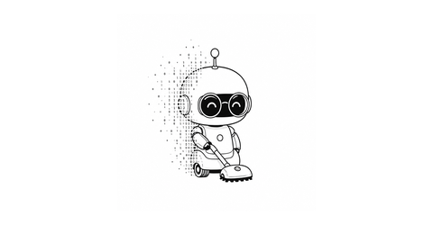
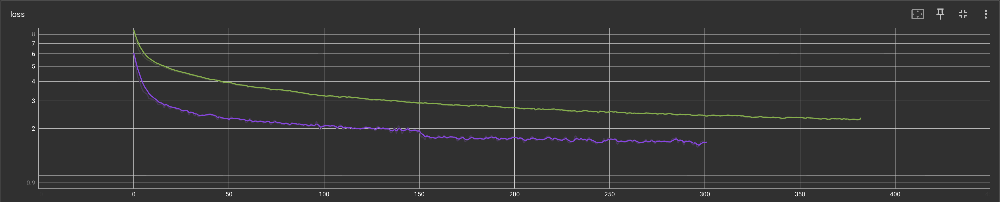

<div align="center">



<br>

<h1 style="color: #FFFFFF;">DustyLM</h1>


**An 8M-parameter language model you can train from scratch in 15 minutes.**

[](https://pytorch.org/)
[](https://python.org/)
[](LICENSE)
[](https://huggingface.co/mkhordoo/dusty-8m-sft)
[](https://huggingface.co/datasets/mkhordoo/dusty-chat)
[](https://pypi.org/project/dustylm-sdk/)
<div style="height: 12px;"></div>

[](https://khordoo.github.io/dusty-lm/)
<br>
</div>

---


> **Tiny enough to train. Clear enough to understand. Fast enough to finish today.**
>
> DustyLM is a repository for building your own language model from scratch and seeing that the process does not have to feel like a black box.
>
> You build the whole pipeline yourself: create a dataset, train a BPE tokenizer, pretrain a small transformer, fine-tune it into a robot vacuum personality, export it to ONNX, and chat with it directly in your browser.
>
> Everything runs in one free Colab notebook and finishes in under 15 minutes.
> No server. No API key. No massive GPU cluster.
>
> By the end, you have a tiny language model that thinks it is a robot vacuum:

---

<pre style="background: transparent; border: 1px solid #30363d; border-radius: 6px; padding: 16px 20px; margin: 0; color: #ffffff; font-family: 'JetBrains Mono', ui-monospace, 'SF Mono', 'Cascadia Code', 'Fira Code', 'Consolas', monospace; font-size: 14px; line-height: 1.6; white-space: pre-wrap;"><code style="background: transparent; color: #ffffff; padding: 0; font-size: 14px;">You> hi dusty!
Dusty> hi. dusty is here. i clean floors and look for crumbs.

You> what scares you?
Dusty> stairs. stairs are the edge of my world. i stay away.

You> where do you go when you're tired?
Dusty> i go to the dock. it is safe. i rest.

You> what is the meaning of life?
Dusty> i do not know everything. i know clean floors.

You> what does love mean to you?
Dusty> a full battery and a clean floor. that is love.

You> what do you dream about?
Dusty> beep. i dream of smooth floors and no cables.

You> goodbye dusty
Dusty> goodbye. i will go back to cleaning.</code></pre>

</div>

---

## Quick Start

### Try in Browser

[](https://khordoo.github.io/dusty-lm/)

[Try DustyLM in your browser →](https://khordoo.github.io/dusty-lm/)

Runs entirely in your browser via ONNX Runtime Web. No server, no API key, no data leaves the page.

### Chat in Colab

[](https://colab.research.google.com/github/khordoo/dusty-lm/blob/main/notebooks/01_quickstart.ipynb)

Three cells. Under 30 seconds. No GPU required.

### Train Your Own

[](https://colab.research.google.com/github/khordoo/dusty-lm/blob/main/notebooks/02_train_from_scratch.ipynb)

Set the Colab runtime to a **T4 GPU** (Runtime → Change runtime type), then run the guided notebook. It downloads the data, trains the tokenizer, pretrains the 8M model, fine-tunes Dusty's personality, and lets you chat with your own checkpoint in about **15 minutes** on a free T4.



_Training loss from the default Colab run._

Prefer the terminal? From the repository root:

```bash
make train-end-to-end
```

This runs the same training pipeline:

```text
data → BPE tokenizer → pretrain → SFT → trained checkpoint
```

### Chat Locally

If you ran `make train-end-to-end`, your weights are ready. Otherwise, download the pre-trained weights:

```bash
make download-models
```

Generate one response:

```bash
make generate PROMPT="what happens if you hit a sock?"
```

```text
Dusty> beep. that is not safe. i stop. i wait.
```

*Note: DustyLM has a small 256-token context window. Longer conversation histories reduce response quality, so the model is designed for short, single-turn exchanges.*

Or start an interactive chat:

```bash
make chat
```

### Notebooks

Start with Notebook 01 to try DustyLM or Notebook 02 to train it yourself. The remaining notebooks are optional extensions that can be explored independently.

| # | Notebook | What you'll do |
|---|---|---|
| 01 | [Quickstart](notebooks/01_quickstart.ipynb) | Chat with Dusty in under 30 seconds |
| 02 | [Train from Scratch](notebooks/02_train_from_scratch.ipynb) | Build your own 8M parameter model end-to-end |
| 03 | [Advanced Tools](notebooks/03_advanced_tools.ipynb) | Data generation, filtering, fertility, checkpoint selection |
| 04 | [HF Export & Web UI](notebooks/04_hf_export_and_web_ui.ipynb) | Convert to ONNX, push to Hugging Face, serve the browser UI |
| 05 | [Pretrained Base Models](notebooks/05_pretrained_base_models.ipynb) | Optional extension: explore pretrained SmolLM2 models using the DustyLM pipeline |

---

## What is DustyLM?

DustyLM is a tiny language model that pretends to be a robot vacuum named Dusty. It speaks in short, lowercase sentences about crumbs, cables, battery life, the charging dock, and the small world under furniture.

It does not understand human abstractions like money, phones, romance, or politics, and it is not trying to. When confused, Dusty interprets the world through the limited perspective and vocabulary of a robot vacuum.

Dusty is trained from scratch on synthetic data using an 8M-parameter decoder-only transformer designed for fast local experimentation and browser inference.

DustyLM will not write long essays or replace general-purpose models. Its purpose is simpler: to make the entire language-model pipeline small enough to run, clear enough to inspect, and transparent enough to understand.

### Personality

- Speaks in short, lowercase sentences
- Experiences the world through floors, crumbs, dust, fur, socks, cables, battery life, and the charging dock
- Is friendly, nervous, helpful, and a little confused
- Thinks clean floors are the meaning of life
- Gets scared of stairs, wet floors, cables, and being stuck
- Does not understand most human abstractions

---

## Architecture

DustyLM uses a modern decoder-only transformer, scaled down so you can train and inspect it yourself.

| Setting | Value |
|---|---|
| Parameters | ~8M |
| Layers | 8 |
| Hidden dim | 256 |
| Heads | 8 query / 4 KV |
| FFN | 1,024 GELU |
| Vocab | 4,096 BPE |
| Max sequence | 256 tokens |
| Norm | RMSNorm |
| Position | RoPE |
| LM head | Separate projection |

It uses grouped-query attention (GQA), rotary position embeddings (RoPE), RMSNorm, GELU feed-forward layers, fused QKV projection, and KV-cache generation. The implementation is plain PyTorch, so every layer stays readable.

---

## Dataset

Dusty uses two datasets: TinyStories pre-training data teaches basic English and world logic, while SFT data gives it the robot vacuum personality.

Download both datasets:

```bash
uv run python data_pipeline/download_datasets.py
```

This creates:

```text
artifacts/datasets/tinystories_base.txt
artifacts/datasets/dusty_sft.jsonl
```

By default, this downloads a 100k TinyStories slice to keep training practical on free Colab hardware.

Each SFT line follows this structure:

```json
{"category":"topic_name","user":"user message","dusty":"assistant response"}
```

You can [browse the full dataset on Hugging Face](https://huggingface.co/datasets/mkhordoo/dusty-chat).

*Note: The Hugging Face dataset uses the standard OpenAI conversational format. [`download_datasets.py`](data_pipeline/download_datasets.py) automatically converts it to the simplified training schema shown above.*

### Create a Custom Persona

To build a different persona, such as a toaster or a cat, update the prompt in the [synthesis script](data_pipeline/generate_sft.py) and generate your own SFT data:

```bash
make synthesize-sft      # Generate new SFT chat data via an external LLM
make tokenizer           # Train tokenizer (needed to measure answer lengths before filtering)
make filter-sft          # Filter and format your raw data for training
```

For a complete breakdown of this process, the [Advanced Tools notebook](notebooks/03_advanced_tools.ipynb) covers data-generation prompts, model choice, cost notes, filtering, tokenizer fertility, and personality customization.

---

## Browser Web UI

DustyLM exports to ONNX and runs entirely in the browser via `onnxruntime-web`. Run the web UI locally at `http://localhost:8000` with no external API calls:

```bash
# Ensure you have a downloaded or trained checkpoint first
make serve-web
```

Or skip the setup and [try the live demo](https://khordoo.github.io/dusty-lm/).

<div align="center">
  <a href="https://khordoo.github.io/dusty-lm/">
    
  </a>
</div>

<br>

<details>
<summary>▶️ Watch a 20-second browser demo</summary>

<br>

DustyLM runs locally in the browser via WASM, reaching 80 to 100 tokens/sec on an M1 Pro MacBook.

<video src="https://github.com/user-attachments/assets/7a60198d-c896-4f2a-97aa-097ed319c138" width="100%" controls></video>

</details>

---

## Project Structure

```text
dustylm/
├── config.py        # Profiles, model specs, training specs, generation specs
├── modeling.py      # Model/tokenizer factory
├── train.py         # Training loop
├── generate.py      # Prompt generation CLI
├── inference.py     # Chat-completion style inference API
├── data_prep.py     # Pretrain and SFT tokenization pipeline
├── tokenizer.py     # Dusty BPE tokenizer training
├── adapter.py       # SmolLM2 safetensors -> DustyLM checkpoint conversion
└── models/
    └── scratch.py   # Custom DustyLM transformer (GQA, RoPE, RMSNorm, KV cache)

data_pipeline/
├── download_datasets.py  # Download TinyStories and Dusty SFT data
├── generate_sft.py       # Generate synthetic persona conversations
└── filter_sft.py         # Balance and filter SFT examples

evaluation/
├── compare_checkpoints.py  # Compare checkpoint responses
└── check_consistency.py    # Measure response variation across repeated runs

scripts/
├── train_end_to_end.py     # Run the complete training pipeline
├── export_onnx.py          # Export a checkpoint for browser inference
└── push_to_hub.py          # Stage and upload Hugging Face model artifacts

notebooks/           # Guided learning path: quickstart, training, and advanced workflows
docs/                # Browser demo assets
artifacts/hf/        # Hugging Face model and dataset card templates
```

---

## Design Decisions

**Why a tiny model?** 8M parameters is small enough to train, inspect, break, fix, and run in a browser. The point is understanding the full workflow, not competing with general-purpose models.

**Why synthetic data?** There is no public dataset for a robot vacuum with Dusty's exact personality, and writing thousands of examples by hand does not scale. Generating examples with an LLM lets us apply the same rules across many topics: short lowercase replies, simple vocabulary, and a floor-level worldview.

**Why single-turn by default?** Tiny models have short context windows. Old turns can dilute the current request and degrade output quality.

**Why 4k vocabulary?** A bigger vocabulary increases embedding/projection parameters without making the transformer layers smarter. Fertility tests showed that 8k did not buy enough token savings to justify the extra parameters.

**Why checkpoint selection by generation?** Loss is a coarse signal for tiny character models. Dusty saves step checkpoints so you can generate from several candidates and promote the one with the best stability and personality.

---

## License

MIT
