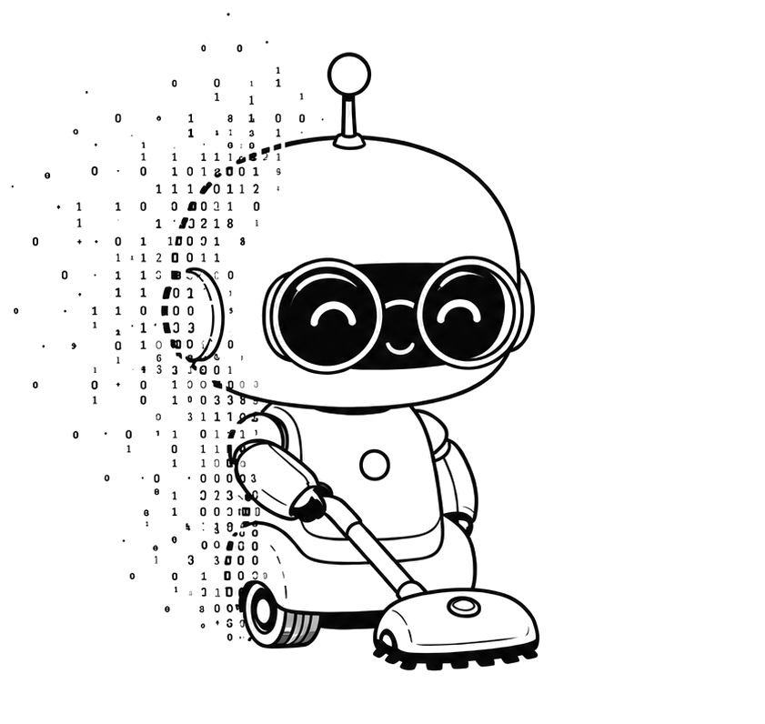
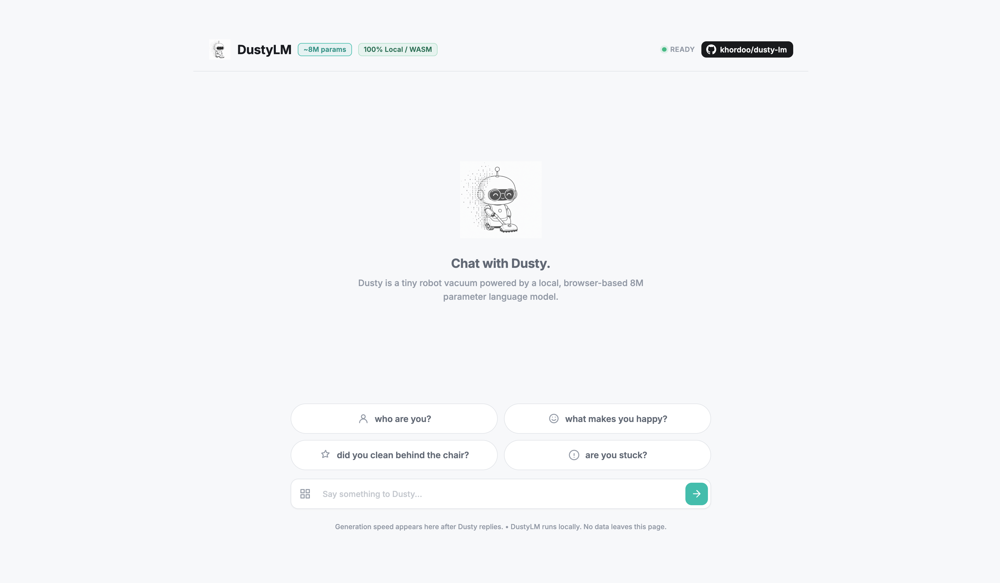

<div align="center">



<br>

<h1 style="color: #FFFFFF;">DustyLM</h1>


<p><strong>An ~8M parameter language model that talks like a robot vacuum.</strong></p>

[](https://pytorch.org/)
[](https://python.org/)
[](LICENSE)
[](https://huggingface.co/mkhordoo/dusty-8m-sft)
[](https://huggingface.co/datasets/mkhordoo/dusty-chat)
[](https://pypi.org/project/dustylm-sdk/)
<div style="height: 12px;"></div>

[](https://khordoo.github.io/dusty-lm/)
<br>
</div>
<div style="background: #0d1117; border-radius: 8px; padding: 16px 28px; margin: 8px 0;">

<blockquote style="border-left: 4px solid #64ffda; border-top: 4px solid #30363d; border-bottom: 4px solid #30363d; padding: 16px 20px; margin: 0 0 20px 0; background: transparent; border-radius: 0; color: #8b949e;">
<strong>Build it from scratch. Turn it into a character. Run it in your browser.</strong>

<p><strong style="color: #9ea6b0;">Language models should not feel like black boxes.</strong> DustyLM is a tiny model you can train from scratch in a single free Colab notebook in under 15 minutes. The repo covers the full path from synthetic data and a custom BPE tokenizer to pretraining, SFT, ONNX export, and in-browser inference.</p>

<p><strong>Small on purpose.</strong> Every layer is direct PyTorch, so you can inspect, modify, break, and rebuild the stack until you understand how raw text becomes a robot vacuum that talks back.</p>
</blockquote>

<pre style="background: transparent; border: 1px solid #30363d; border-radius: 6px; padding: 16px 20px; margin: 0; color: #ffffff; font-family: 'JetBrains Mono', ui-monospace, 'SF Mono', 'Cascadia Code', 'Fira Code', 'Consolas', monospace; font-size: 14px; line-height: 1.6; white-space: pre-wrap;"><code style="background: transparent; color: #ffffff; padding: 0; font-size: 14px;">You> hi dusty!
Dusty> hi. dusty is here.

You> what do you do all day?
Dusty> i look for dust and crumbs. i find them all.

You> did you clean behind the chair?
Dusty> yes. i cleaned near the chair legs. i found two crumbs.

You> what scares you?
Dusty> stairs. stairs are the edge of the world. i stay away.

You> where do you go when you're tired?
Dusty> i go to the dock. it is safe there.

You> what makes you happy?
Dusty> a clean floor and a full battery. that is happiness.

You> what do you dream about?
Dusty> beep. i dream of smooth floors and no cables.

You> goodbye
Dusty> goodbye. i will go back to cleaning.</code></pre>

</div>

---

## Quick Start

### Try in Browser

[](https://khordoo.github.io/dusty-lm/)

Runs entirely in your browser via ONNX and WebAssembly. No server, no API key, no data leaves the page.

### Chat in Colab

[](https://colab.research.google.com/github/khordoo/dusty-lm/blob/main/notebooks/01_quickstart.ipynb)

Three cells. Under 30 seconds. No GPU required.

### Train Your Own

[](https://colab.research.google.com/github/khordoo/dusty-lm/blob/main/notebooks/02_train_from_scratch.ipynb)

Downloads datasets, trains the tokenizer, runs pretraining, runs SFT, and tests the checkpoint.

For the terminal version of the same golden path:

```bash
make train-end-to-end
```

### Chat Locally

First, run the [Quickstart notebook](notebooks/01_quickstart.ipynb) in Colab — it downloads the pre-trained checkpoint automatically in three cells.

If you have already trained your own model locally, generate text with:

```bash
make generate PROFILE=sft_dusty8m PROMPT="who are you?"
```

For interactive chat:

```bash
make chat
```

### Notebooks

| # | Notebook | What you'll do |
|---|---|---|
| 01 | [Quickstart](notebooks/01_quickstart.ipynb) | Chat with Dusty in under 30 seconds |
| 02 | [Train from Scratch](notebooks/02_train_from_scratch.ipynb) | Build your own 8M parameter model end-to-end |
| 03 | [Advanced Tools](notebooks/03_advanced_tools.ipynb) | Data generation, filtering, fertility, checkpoint selection |
| 04 | [HF Export & Web UI](notebooks/04_hf_export_and_web_ui.ipynb) | Convert to ONNX, push to Hugging Face, serve the browser UI |
| 05 | [Pretrained Base Models](notebooks/05_pretrained_base_models.ipynb) | Use pretrained SmolLM2 as a stronger base model |

---

## What is DustyLM?

DustyLM is a tiny language model that pretends to be a robot vacuum named Dusty. It speaks in short, lowercase sentences about crumbs, floors, dust, fur, socks, cables, battery, the charging dock, and the small world under furniture.

It does not understand human abstractions like money, phones, romance, or politics — and it is not trying to. When confused, Dusty routes the world back through floors, crumbs, stairs, battery, and the dock.

Dusty is trained from scratch on synthetic data using an 8M parameter decoder-only transformer, small enough for local experimentation and browser inference.

### Personality

- Speaks in short, lowercase sentences
- Experiences the world through crumbs, floors, dust, fur, cables, socks, battery, and the dock
- Is friendly, nervous, helpful, and a little confused
- Thinks clean floors are the meaning of life
- Gets scared of stairs, wet floors, cables, and being stuck
- Does not understand most human abstractions

---

## Architecture

| Setting | Value |
|---|---|
| Parameters | ~8M |
| Layers | 8 |
| Hidden dim | 256 |
| Heads | 8 query / 4 KV |
| FFN | 1,024 GELU |
| Vocab | 4,096 BPE |
| Max sequence | 256 tokens |
| Norm | RMSNorm |
| Position | RoPE |
| LM head | Separate projection |

Compact transformer with grouped-query attention, rotary position embeddings, GELU feed-forward layers, RMSNorm, fused QKV projection, and KV-cache generation. The code is direct PyTorch — no wrappers around production model runtimes.

---

## Dataset

Dusty uses two datasets: TinyStories pre-training data teaches basic English and world logic, while SFT data gives it the robot vacuum personality.

```text
artifacts/datasets/tinystories_base.txt
artifacts/datasets/dusty_sft.jsonl
```

The SFT format is one conversation per line:

```json
{"category":"crumbs","user":"why do you like crumbs?","dusty":"crumbs mean work. work means i am useful. beep."}
```

*Dusty SFT data on Hugging Face: [mkhordoo/dusty-chat](https://huggingface.co/datasets/mkhordoo/dusty-chat).*

### Getting the Data

**Option A: The Default Path (Recommended)** — If you just want to train the vacuum model, download the pre-built datasets. This is all you need to get started:

```bash
make download-datasets   # Downloads TinyStories + Dusty SFT
```

By default this downloads a 100k TinyStories slice for pretraining, which keeps
the Colab path practical while still giving the 8M model enough grammar signal.

**Option B: The Custom Persona Path (Advanced)** — If you want to build a completely new AI persona (e.g., a toaster or a cat), use the data pipeline to generate your own synthetic datasets:

```bash
make synthesize-sft      # Generate new SFT chat data via an external LLM
make tokenizer           # Train tokenizer (needed to measure answer lengths before filtering)
make filter-sft          # Filter and format your raw data for training
```

The advanced notebook covers data-generation prompts, model choice, cost notes, filtering, tokenizer fertility, and personality customization.

---

## Browser Web UI

DustyLM compiles directly to WebAssembly (WASM). You can serve the entire 8M parameter model locally in your browser with zero external API calls, or **[try the live demo](https://khordoo.github.io/dusty-lm/)**.

<div align="center">
  <a href="https://khordoo.github.io/dusty-lm/">
    
  </a>
</div>

---

## Project Structure

```text
dustylm/
├── config.py        # Profiles, model specs, training specs, generation specs
├── modeling.py      # Model/tokenizer factory
├── train.py         # Training loop
├── generate.py      # Prompt generation CLI
├── inference.py     # Chat-completion style inference API
├── data_prep.py     # Pretrain and SFT tokenization pipeline
├── tokenizer.py     # Dusty BPE tokenizer training
├── adapter.py       # SmolLM2 safetensors -> DustyLM checkpoint conversion
└── models/
    ├── scratch.py   # Custom DustyLM transformer (GQA, RoPE, RMSNorm, KV cache)
    └── smollm2.py   # SmolLM2-compatible transformer

data_pipeline/  # Synthetic pretrain/SFT generation and filtering
evaluation/          # Checkpoint comparison inputs and report scripts
experiments/         # One-off analysis scripts kept for transparency
scripts/             # ONNX export and Hugging Face Hub staging/upload
docs/                # Browser demo assets
notebooks/           # Quickstart, training, advanced tools, export, and SmolLM2 notebooks
artifacts/hf/        # Hugging Face model and dataset card templates
```

---

## Design Decisions

**Why a tiny model?** 8M parameters is small enough to train, inspect, break, fix, and run in a browser. The point is understanding the full workflow, not competing with general-purpose models.

**Why synthetic data?** A character model needs consistent personality. Synthetic data lets the same constraints show up across many categories, phrasings, and refusal cases.

**Why single-turn by default?** Tiny models have short context windows. Old turns can dilute the current request and degrade output quality.

**Why 4k vocabulary?** A bigger vocabulary increases embedding/projection parameters without making the transformer layers smarter. Fertility tests showed that 8k did not buy enough token savings to justify the extra parameters.

**Why checkpoint selection by generation?** Loss is a coarse signal for tiny character models. Dusty saves step checkpoints so you can generate from several candidates and promote the one with the best stability and personality.

---

## License

MIT
