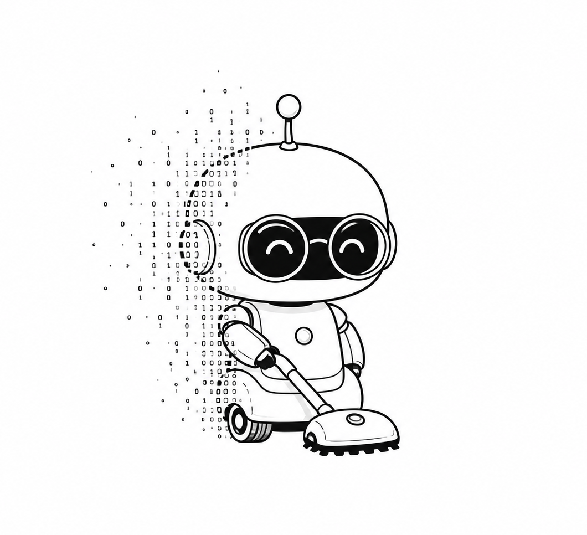

<div align="center">



<h1>DustyLM</h1>

<p><strong>An ~8M parameter language model that talks like a tiny robot vacuum.</strong></p>

[](https://pytorch.org/)
[](https://python.org/)
[](LICENSE)
[](https://huggingface.co/mkhordoo/dusty-8m-sft)

[](https://khordoo.github.io/dusty-lm/)
[](https://colab.research.google.com/github/mkhordoo/dusty-lm/blob/main/notebooks/01_quickstart.ipynb)

</div>

---

> This project exists to show that training your own small language model is not magic. No massive GPU cluster required. The repo includes synthetic data generation, tokenizer training, model architecture, pretraining, SFT, checkpoint selection, and browser deployment.
>
> DustyLM will not write essays or replace a general assistant. It is small on purpose: you can inspect every part of the stack and understand how raw text becomes a trained character model.

```text
You> who are you?
Dusty> i am a little robot. i clean floors and find crumbs.

You> where are you?
Dusty> i am under the couch. there are crumbs here.

You> are you scared?
Dusty> a little. i am not stuck. i am brave. i am safe. 

You> what do you dream about?
Dusty> floors. clean ones. and a full battery.

You> what is your job ?
Dusty> i clean every day.

You> go to dock
Dusty> beep. i see the dock. i am safe.
```

---

## What is DustyLM?

DustyLM is a tiny language model that pretends to be a robot vacuum named Dusty. It speaks in short, lowercase sentences about crumbs, floors, dust, fur, socks, cables, battery, the charging dock, and the small world under furniture.

It does not understand human abstractions like money, phones, romance, or politics, and it is not trying to. When confused, Dusty routes the world back through floors, crumbs, stairs, battery, and the dock.

Dusty is trained from scratch on synthetic Dusty text and chat examples using an ~8M parameter decoder-only transformer small enough for local experimentation and browser inference.

---

## Architecture

| Setting | Value |
|---|---|
| Parameters | ~8M |
| Layers | 8 |
| Hidden dim | 256 |
| Heads | 8 query / 4 KV |
| FFN | 1,024 GELU |
| Vocab | 4,096 BPE |
| Max sequence | 256 tokens |
| Norm | RMSNorm |
| Position | RoPE |
| LM head | Separate projection |

Compact transformer with grouped-query attention, rotary position embeddings, GELU feed-forward layers, RMSNorm, fused QKV projection, and KV-cache generation. The code is intentionally direct PyTorch rather than a wrapper around a production model runtime.

---

## Personality

Dusty:

- Speaks in short, lowercase sentences
- Experiences the world through crumbs, floors, dust, fur, cables, socks, battery, and the dock
- Is friendly, nervous, helpful, and a little confused
- Thinks clean floors are the meaning of life
- Gets scared of stairs, wet floors, cables, and being stuck
- Does not understand most human abstractions

60 topics: crumbs, chips, cereal, popcorn, sugar, rice, cookie, pizza, bread, carpet, hardwood, tile, rug, corners, under the couch, under the bed, kitchen floor, bathroom floor, going home, low battery, charging, full battery, home dock, cat hair, dog hair, pets blocking the path, being full of fur, socks, legos, cables, wet floor, stairs, big pieces, chair legs, stuck in a corner, stuck under furniture, needing help, being rescued, why Dusty cleans, dirty floors, clean floors, being thanked, being ignored, Dusty's thoughts, money, love, politics, weather, internet, school, movies, music, sleep, food for humans, Dusty's introduction, Dusty's feelings, Dusty's dreams, Dusty's fears, Dusty's friends, and tomorrow.

---

## Quick Start

### Try in Browser

[](https://khordoo.github.io/dusty-lm/)

Runs locally in your browser with ONNX and WebAssembly. No server and no API key.

### Chat in Colab

[](https://colab.research.google.com/github/mkhordoo/dusty-lm/blob/main/notebooks/01_quickstart.ipynb)

Three cells. Under 30 seconds. No GPU required.

### Train Your Own

[](https://colab.research.google.com/github/mkhordoo/dusty-lm/blob/main/notebooks/02_train_from_scratch.ipynb)

Downloads the datasets, trains the tokenizer, runs pretraining, runs SFT, and tests the checkpoint.

### Chat Locally

```bash
uv sync
make dusty-generate PROFILE=sft_dusty8m PROMPT="where are you?"
```

For an interactive terminal chat:

```bash
make chat
```

### Notebooks

| # | Notebook | What you'll do |
|---|---|---|
| 01 | [Quickstart](notebooks/01_quickstart.ipynb) | Chat with Dusty in under 30 seconds |
| 02 | [Train from Scratch](notebooks/02_train_from_scratch.ipynb) | Build your own 8M parameter model end-to-end |
| 03 | [Advanced Tools](notebooks/03_advanced_tools.ipynb) | Data generation, filtering, fertility, checkpoint selection |
| 04 | [HF Export & Web UI](notebooks/04_hf_export_and_web_ui.ipynb) | Convert to ONNX, push to Hugging Face, and serve the browser UI |
| 05 | [Pretrained Base Models](notebooks/05_pretrained_base_models.ipynb) | Use pretrained SmolLM2 as a stronger base model |

---

## Dataset

Dusty SFT data is available on Hugging Face: [mkhordoo/dusty-chat](https://huggingface.co/datasets/mkhordoo/dusty-chat).

Dusty uses two local training files under `artifacts/datasets/`:

```text
artifacts/datasets/dusty_pretrain.txt
artifacts/datasets/dusty_sft.jsonl
```

The SFT JSONL format is one conversation per line:

```json
{"category":"crumbs","user":"where are you?","dusty":"i am under the couch. there are crumbs here."}
```

Download the default TinyStories pretraining slice and Dusty SFT data:

```bash
make download-datasets
```

Generate custom Dusty-style data with OpenRouter-backed scripts:

```bash
make dusty-generate-pretrain
make dusty-generate-sft
make dusty-filter-sft
```

The advanced notebook explains the data-generation prompt, model choice, cost notes, filtering, tokenizer fertility, and how to change the personality.

---

## Project Structure

```text
dustylm/
├── config.py        # Profiles, model specs, training specs, generation specs
├── model.py         # Compatibility import for the scratch DustyLM model
├── modeling.py      # Model/tokenizer factory
├── train.py         # Training loop
├── generate.py      # Prompt generation CLI
├── inference.py     # Chat-completion style inference API
├── data_prep.py     # Pretrain and SFT tokenization pipeline
├── tokenizer.py     # Dusty BPE tokenizer training
├── adapter.py       # SmolLM2 safetensors -> DustyLM checkpoint conversion
└── models/
    ├── scratch.py   # Custom DustyLM transformer
    └── smollm2.py   # SmolLM2-compatible transformer

dataset_generation/  # Synthetic pretrain/SFT generation and filtering
scripts/             # ONNX export and Hugging Face Hub staging/upload
docs/                # Browser demo assets
notebooks/           # Quickstart, training, advanced tools, export, and SmolLM2 notebooks
```

---

## Design Decisions

**Why a tiny model?**

An 8M parameter model is small enough to train, inspect, break, fix, and run in a browser. The point is understanding the full workflow, not competing with general-purpose models.

**Why synthetic data?**

A character model needs consistent personality. Synthetic data lets the same constraints show up across many categories, phrasings, and refusal cases.

**Why single-turn by default?**

Tiny models have short context windows. Dusty defaults to a small chat window because old turns can dilute the current request and degrade output quality.

**Why 4k vocabulary?**

A bigger vocabulary increases embedding/projection parameters without making the transformer layers smarter. Fertility tests showed that moving Dusty from about 4k to 8k vocabulary did not buy enough token savings to justify the extra parameters.

**Why checkpoint selection by generation?**

Loss is only a coarse signal for tiny character models. Dusty training saves step checkpoints so you can generate from several candidates and promote the one with the best stability and personality.

---

## License

MIT
